# Multi-LAN Routing Lab – 3 Routers over Serial WAN Links

## 📌 Overview
This project extends a basic router lab into a larger, multi-site network. Three routers, each serving its own LAN, are connected in a chain using two serial WAN links. Static routes were configured on each router so that PCs on any of the three LANs can ping PCs on the other two — even across multiple hops.

## 🗺️ Network Topology


The network consists of:
- **3 Routers** — Router0, Router1, and Router2, connected in a line over serial links
- **3 Switches** — one per router, each connecting 4 PCs
- **12 PCs total**, split across three separate LANs
- **2 Serial WAN links** connecting the routers together (Router0 ↔ Router1, and Router1 ↔ Router2)

| Site | LAN Subnet | Router | Devices |
|---|---|---|---|
| Site 1 | 192.168.10.0/24 | Router0 | PC0, PC1, PC2, PC3 |
| Site 2 | 192.168.20.0/24 | Router1 | PC4, PC5, PC6, PC7 |
| Site 3 | 192.168.30.0/24 | Router2 | PC8, PC9, PC10, PC11 |

## 🧮 IP Addressing Table

### LAN interfaces
| Router | Interface | IP Address | Subnet Mask |
|---|---|---|---|
| Router0 | GigabitEthernet0/0/0 | 192.168.10.5 | 255.255.255.0 |
| Router1 | GigabitEthernet0/1 | 192.168.20.5 | 255.255.255.0 |
| Router2 | GigabitEthernet0/1 | 192.168.30.5 | 255.255.255.0 |

### WAN (serial) links
| Link | Router0 side | Router1 side | Router2 side | Network |
|---|---|---|---|---|
| Link 1 | Se0/1/0 — 12.1.1.1 | Se0/1/0 — 12.1.1.2 | — | 12.0.0.0/8 |
| Link 2 | — | Se0/1/1 — 23.1.1.1 | Se0/1/0 — 23.1.1.2 | 23.0.0.0/8 |

## ⚙️ Routing Configuration
Since each router only directly connects to its immediate neighbor, static routes were added so every router knows how to reach the two LANs it isn't directly connected to.

**Router0** (reaches Site 2 and Site 3 via Router1):
```
ip route 192.168.20.0 255.255.255.0 12.1.1.2
ip route 192.168.30.0 255.255.255.0 12.1.1.2
```

**Router1** (reaches Site 1 via Router0, Site 3 via Router2):
```
ip route 192.168.10.0 255.255.255.0 12.1.1.1
ip route 192.168.30.0 255.255.255.0 23.1.1.2
```

**Router2** (reaches Site 1 and Site 2 via Router1):
```
ip route 192.168.10.0 255.255.255.0 23.1.1.1
ip route 192.168.20.0 255.255.255.0 23.1.1.1
```

> Note: adjust the exact next-hop addresses above if your configuration differs slightly from the table.

## ✅ Verification

**Interface status** — confirms IP addressing and that interfaces are up:
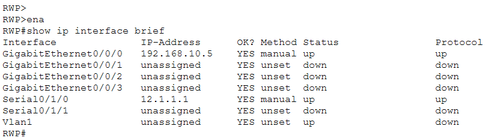
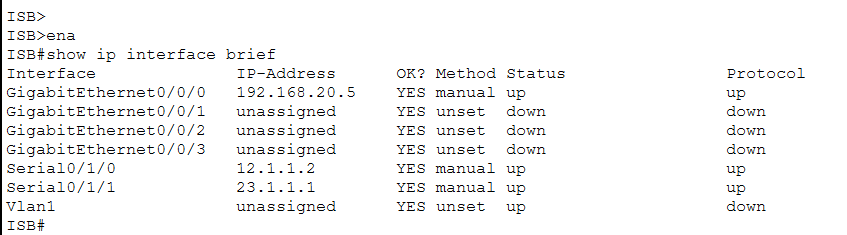
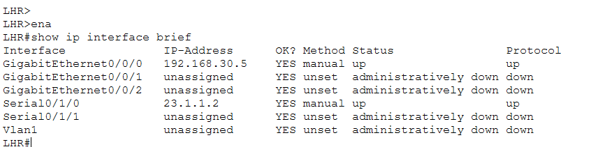

**Running configuration** — shows the full applied configuration, including interfaces and static routes:
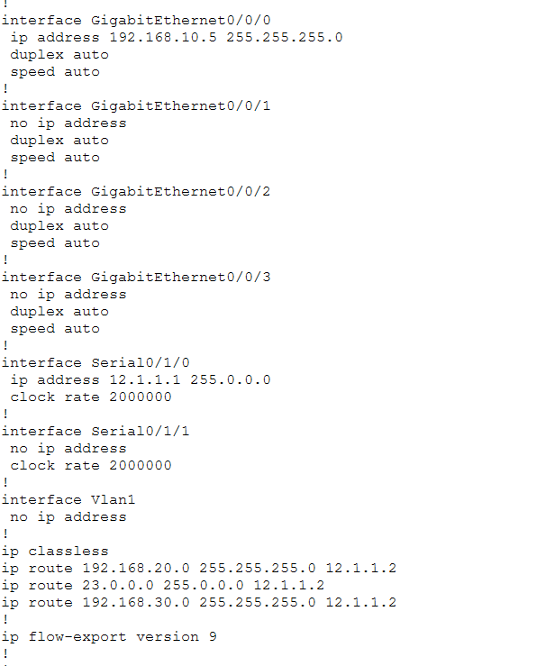
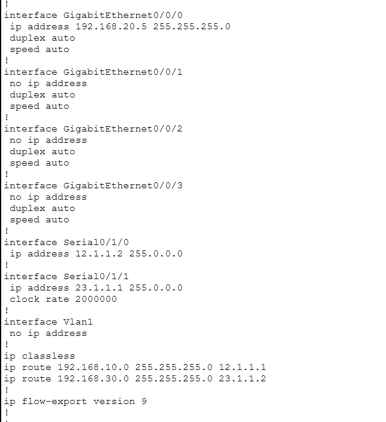
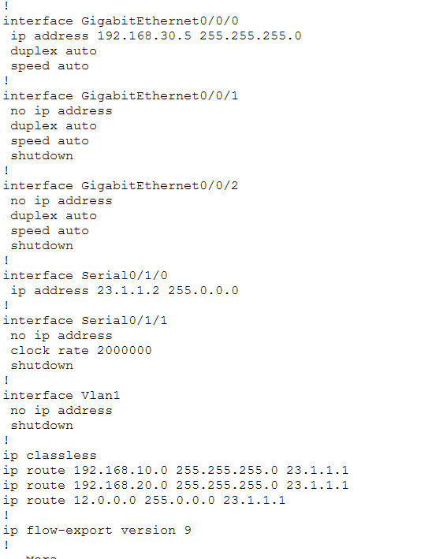

**Routing table** — confirms each router learned/holds routes to the remote LANs:
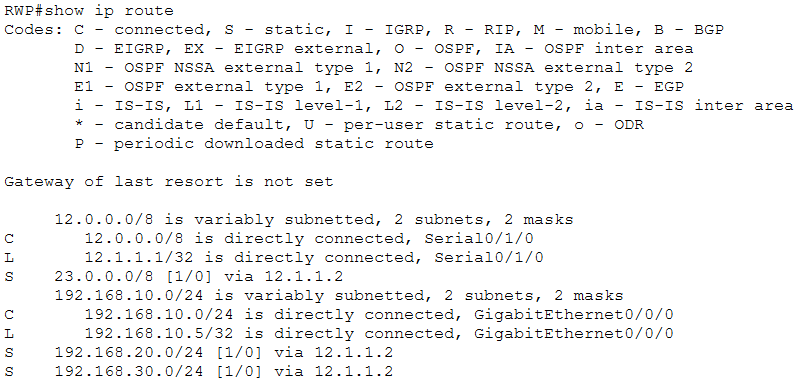
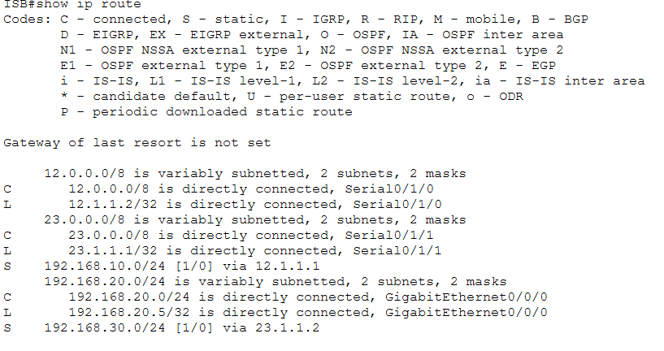
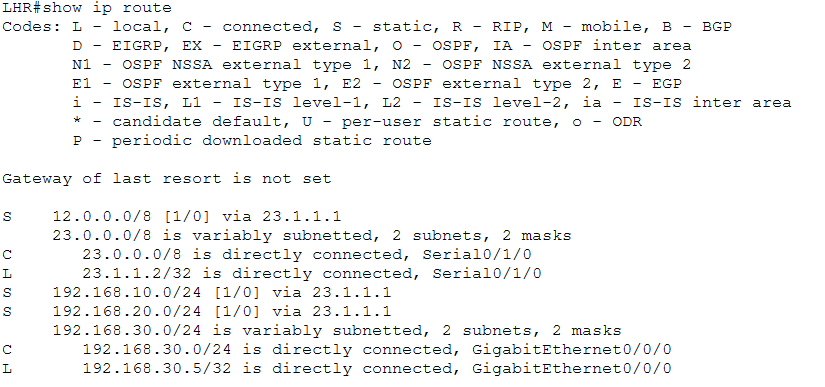


**Connectivity test** — from each site, pinging PCs in both of the other two sites to confirm full end-to-end routing across both WAN hops:
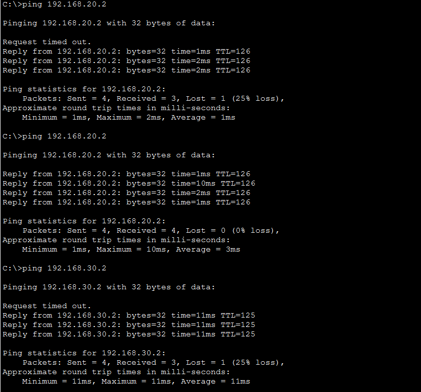
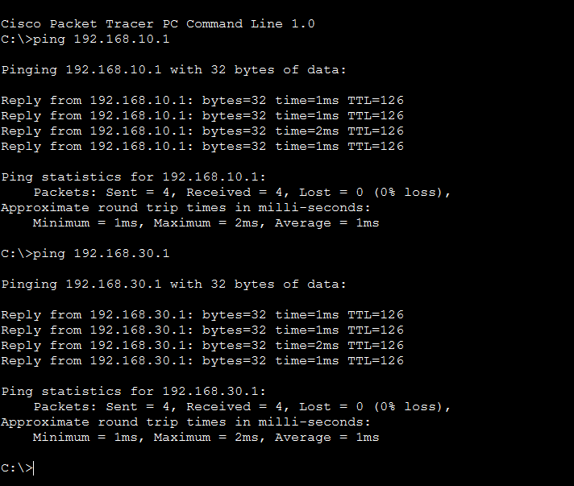
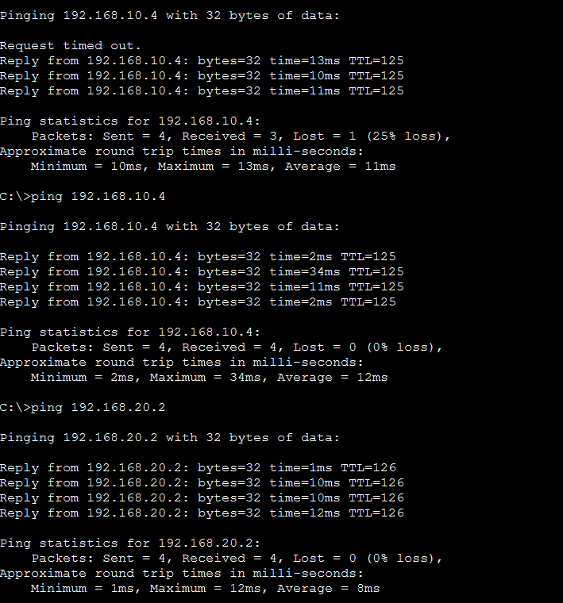

## 🛠️ Tools Used
- Cisco Packet Tracer

## 📂 Repository Contents
- `Lab.pkt` – Packet Tracer project file
- `Topology.png` – Network topology diagram
- `router0-interface-brief.png`, `router1-interface-brief.png`, `router2-interface-brief.png`
- `router0-running-config.png`, `router1-running-config.png`, `router2-running-config.png`
- `router0-ip-route.png`, `router1-ip-route.png`, `router2-ip-route.png`
- `ping-test1.png`, `ping-test2.png`, `ping-test3.png`
- `README.md` – This file

## 👤 Author
Ibraheem

## 📄 License
This project is for educational purposes. Feel free to use or modify it for your own learning.
